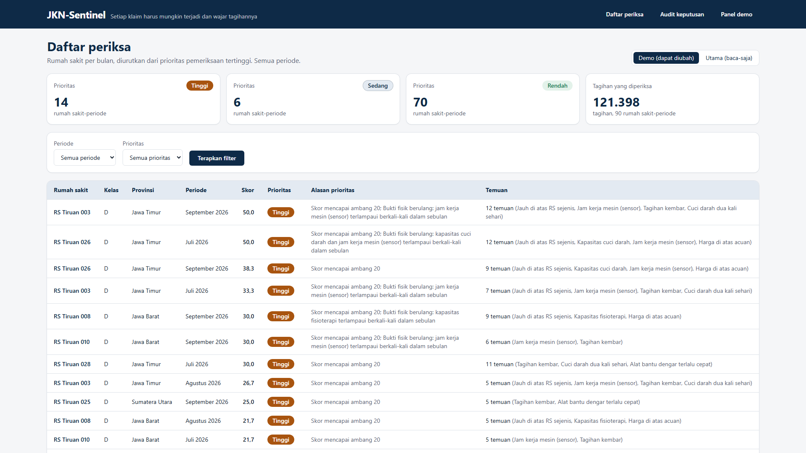
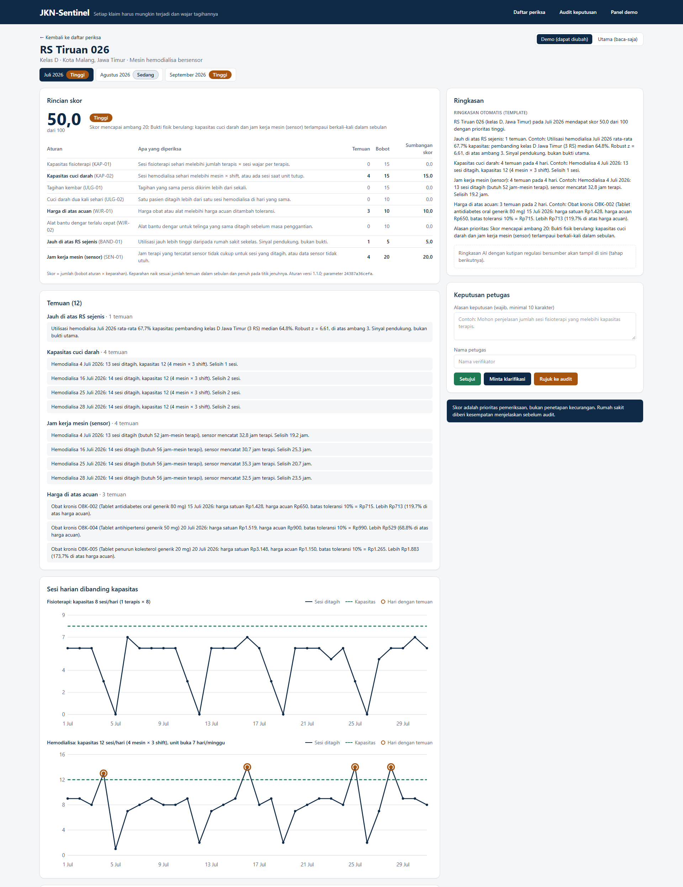

# JKN-Sentinel

> **Seluruh data di repositori ini adalah data tiruan.** Tidak ada data peserta JKN, rumah sakit, maupun klaim asli yang dipakai, diunduh, atau disimpan. Nama rumah sakit adalah samaran, pasien memakai ID pseudonim (`P-000123`), dan semua harga serta sinyal sensor adalah simulasi.

Prototipe untuk proposal **BPJS Kesehatan Healthkathon 2026**, kategori Efisiensi Risiko pada Fasilitas Kesehatan, oleh tim **Sentul Labs** (Rifandi Indrayudha Prawira, Joesavat Donovan, Akbar).

## Apa itu JKN-Sentinel?

Setiap hari rumah sakit mengirim tagihan ke BPJS untuk layanan peserta JKN. JKN-Sentinel memeriksa setiap tagihan dengan dua pertanyaan sederhana: **mungkinkah layanan ini benar-benar terjadi** dengan tenaga, mesin, dan jam kerja yang dimiliki rumah sakit, dan **wajarkah tagihannya** menurut harga acuan dan aturan penggantian alat. Bila sebuah rumah sakit menagih lebih banyak sesi cuci darah daripada yang muat di mesinnya, atau mesinnya menurut sensor tidak bekerja selama yang ditagih, sistem menaikkan rumah sakit itu dalam daftar periksa beserta penjelasan yang bisa dibaca siapa pun. Sistem tidak menuduh: **skor adalah prioritas pemeriksaan, bukan penetapan kecurangan**, dan keputusan selalu di tangan petugas setelah rumah sakit diberi kesempatan menjelaskan.



## Alur empat langkah

| Langkah | Yang dilakukan | Teknologi | Status |
|---|---|---|---|
| 1. **Hitung** | Aturan kapasitas, pengulangan, kewajaran harga, dan perbandingan rumah sakit sejenis menghasilkan temuan berpenjelasan dan skor 0–100 | Python, FastAPI, PostgreSQL; aturan deterministik dan robust z-score | ✅ Prototipe |
| 2. **Cek sensor** | Arus listrik mesin hemodialisa diklasifikasikan di perangkat (terapi/siaga/mati), dikirim bertanda tangan dan berantai hash, lalu dibandingkan dengan sesi yang ditagih | Simulasi IoT, Edge AI (pohon keputusan scikit-learn), Ed25519, rantai SHA-256 | ✅ Prototipe (simulasi) |
| 3. **Rangkum** | Ringkasan berbahasa sederhana dengan kutipan regulasi bersumber | Saat ini ringkasan otomatis berbasis template; RAG dan multi-agent | 🟡 Template sekarang; **RAG dan multi-agent: tahap berikutnya** |
| 4. **Putuskan** | Petugas melihat daftar periksa, detail temuan, grafik, dan data sensor, lalu memutuskan; setiap keputusan dirantai hash dan bisa diaudit | Next.js, Tailwind | ✅ Prototipe |



## Hasil evaluasi (data uji tersembunyi)

Angka berikut berasal dari **satu kali** perbandingan keluaran dataset uji tersembunyi (*hidden*) dengan labelnya, pada 2026-10-03T06:02:34Z. Tidak ada parameter yang diubah sesudahnya. Laporan lengkap: [`reports/evaluasi.md`](reports/evaluasi.md).

| Ukuran | Hasil |
|---|---|
| Kejadian kecurangan yang terdeteksi | **83/86** (96,5%; IK95% 90,2–98,8%) |
| Periode rumah sakit bermasalah yang masuk daftar periksa (prioritas tinggi/sedang) | **23/28** (82,1%; IK95% 64,4–92,1%) |
| Periode bermasalah yang terdeteksi tetapi berprioritas rendah | 5/28 (17,9%) |
| Tuduhan yang keliru (dari periode yang diprioritaskan) | **0/26** (0,0%; IK95% 0,0–12,9%) |
| Kasus sah yang perlu klarifikasi petugas | 2/26 (7,7%) |
| Rumah sakit jujur yang ikut ditandai | 3/60 (5,0%) |
| Akurasi klasifikasi Edge AI sensor | **16.892/17.280** (97,8%) |

Angka ini diukur pada **data tiruan**. Jumlah kejadian per skenario kecil, sehingga interval kepercayaannya lebar, dan parameter aturan masih ilustratif. Baca bagian [Keterbatasan](reports/evaluasi.md#keterbatasan) sebelum mengutip angka di atas. Pemeriksaan ulang dengan `make verifikasi-reproduksi` menghasilkan angka yang identik (lihat [`reports/verifikasi_reproduksi.json`](reports/verifikasi_reproduksi.json)).

## Cara menjalankan

### Prasyarat

| Alat | Versi | Dipakai untuk |
|---|---|---|
| Docker + Docker Compose | Docker 24+, Compose v2 | Semua layanan (basis data, backend, dashboard) |
| GNU Make | 4.x | Perintah `make ...` |
| Node.js + npm | 22 LTS | Uji asap, tangkapan layar, dan video (Playwright) |
| Python | 3.11+ | Opsional: menjalankan backend dan tes di luar Docker |

Memasang `make` di Windows: `winget install ezwinports.make`, lalu buka ulang terminal. Di macOS: `xcode-select --install`. Di Linux: paket `make`.

### Demo dari awal

```bash
git clone https://github.com/Sentul-Labs-ID/JKN-Sentinel-Prototype.git
cd JKN-Sentinel-Prototype
cp .env.example .env
make demo          # build, data tiruan, sensor, aturan, dataset demo (±5 menit; lebih lama bila image Docker belum ada)
```

Buka **http://localhost:3000**. Langkah demo singkat:

1. **Daftar periksa**: rumah sakit diurutkan dari prioritas tertinggi.
2. **Panel demo**: pilih rumah sakit berprioritas rendah, sisipkan "fisioterapi melebihi kapasitas terapis" selama 3 hari.
3. Prioritasnya naik menjadi tinggi. Buka detail rumah sakit untuk melihat temuan dan grafik.
4. Catat keputusan **Minta klarifikasi**, lalu buka **Audit keputusan**: rantai utuh.

`make demo-reset` mengembalikan dataset demo ke keadaan awal. Video alur ini ada di [`assets/demo.webm`](assets/demo.webm), dengan naskah di [`docs/NASKAH_DEMO.md`](docs/NASKAH_DEMO.md).

### Perintah lain

| Perintah | Fungsi |
|---|---|
| `make test` | Seluruh tes pytest backend (di container) |
| `make e2e` | Uji asap Playwright terhadap dashboard yang berjalan |
| `make verifikasi-reproduksi` | Bangkitkan ulang semua data di basis data terpisah, hitung ulang, dan bandingkan dengan `reports/evaluasi.json` (±5 menit) |
| `make tangkapan-layar` / `make rekam-demo` | Tangkapan layar dan video 1920×1080 ke `assets/` |
| `make up` / `make down` | Jalankan / hentikan layanan (`DEMO_MODE=true make up` untuk panel demo) |

`make demo` dan perintah pengemasan **tidak** menjalankan evaluasi dataset hidden dan tidak mengubah `reports/`.

## Dokumentasi

- [ROADMAP.md](ROADMAP.md): fase, status, prinsip proyek, catatan penyimpangan
- [docs/ARSITEKTUR.md](docs/ARSITEKTUR.md): alur, aturan, rumus skor, sensor, evaluasi, dashboard
- [docs/prompts/](docs/prompts/README.md): arsip verbatim setiap prompt pengembangan
- [docs/DEVLOG.md](docs/DEVLOG.md), [CHANGELOG.md](CHANGELOG.md), [CLAUDE.md](CLAUDE.md)

Parameter aturan ada di [`config/parameter.yaml`](config/parameter.yaml). **Semua nilai bersifat ilustratif** dan wajib divalidasi bersama BPJS dan organisasi profesi.
