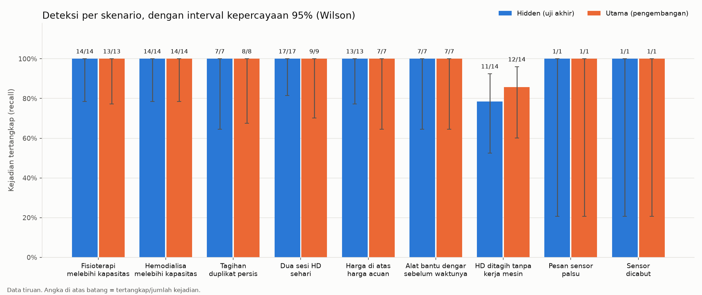
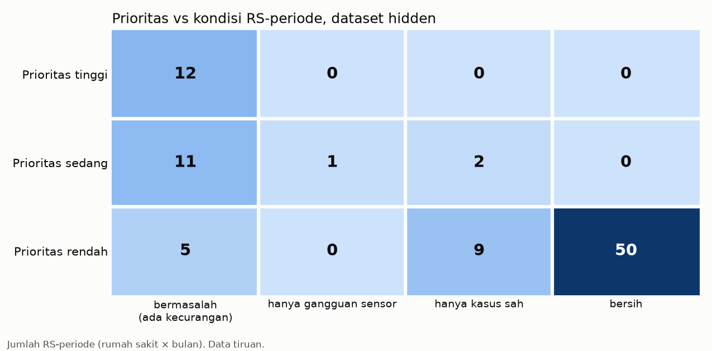

# Laporan evaluasi akurasi KlaimSense

> **Seluruh data adalah data tiruan.** Angka di laporan ini mengukur prototipe pada data simulasi, bukan kinerja pada klaim JKN asli.

Dibuat: 2026-10-03T06:02:34+00:00 · versi aturan 1.1.0 · hash parameter `24387a36cefa`

## Ringkasan

- **Dataset utama** dipakai untuk mengembangkan dan memeriksa kode evaluasi.
- **Dataset hidden** (seed dan distribusi penyisipan berbeda) dievaluasi setelah kode selesai; angka untuk proposal diambil dari hidden.
- **Perbandingan pertama keluaran hidden terhadap label**: 2026-10-03T06:02:34+00:00 (jumlah jalan evaluasi hidden: 1). Tidak ada parameter, bobot, ambang, atau aturan yang diubah berdasarkan hasil hidden.

## Angka untuk proposal (dataset hidden)

**Kecurangan yang tertangkap**: 83/86 (96,5%; IK95% 90,2%–98,8%)

> Dari semua kejadian kecurangan yang disisipkan di data uji tersembunyi (tidak termasuk gangguan sensor), berapa yang ditandai oleh aturan yang memang dirancang untuk jenis kecurangan itu, pada rumah sakit dan tanggal (atau tagihan) yang sama.

**Periode bermasalah yang masuk daftar periksa petugas (prioritas tinggi atau sedang)**: 23/28 (82,1%; IK95% 64,4%–92,1%)

> Dari semua periode rumah sakit (rumah sakit × bulan) yang memuat kecurangan, berapa yang diberi prioritas tinggi atau sedang sehingga masuk daftar yang diperiksa petugas.

**Periode bermasalah yang terdeteksi tetapi berprioritas rendah**: 5/28 (17,9%; IK95% 7,9%–35,6%)

> Dari semua periode rumah sakit yang memuat kecurangan, berapa yang punya temuan tetapi skornya terlalu rendah untuk masuk daftar periksa.

Perbedaannya: sebuah kejadian **terdeteksi** bila ada temuan aturan yang menandainya, sedangkan sebuah periode **masuk daftar periksa** hanya bila temuan-temuannya cukup untuk membuat prioritasnya tinggi atau sedang.

**Tuduhan yang keliru**[^harfiah]: 0/26 (0,0%; IK95% 0,0%–12,9%)

> Dari semua periode rumah sakit (rumah sakit × bulan) yang diberi prioritas tinggi atau sedang, berapa yang sebenarnya tidak berisi kecurangan, bukan kasus sah, dan bukan gangguan sensor.

**Kasus sah yang perlu klarifikasi**: 2/26 (7,7%; IK95% 2,1%–24,1%)

> Dari periode rumah sakit berprioritas tinggi atau sedang, berapa yang hanya berisi kejadian sah di dekat batas aturan (shift darurat, lembur, harga acuan lama). Ini bukan kecurangan; petugas cukup meminta klarifikasi.

**Rumah sakit jujur yang ikut ditandai**: 3/60 (5,0%; IK95% 1,7%–13,7%)

> Dari semua periode rumah sakit jujur (termasuk yang sangat sibuk dan kelas A bervolume tinggi), berapa yang mendapat prioritas tinggi atau sedang. Sebagian berasal dari kasus sah atau gangguan sensor yang memang perlu dicek.

**Akurasi Edge AI**: 16892/17280 (97,8%; IK95% 97,5%–98,0%)

> Dari jendela 10 menit data uji simulasi yang tidak dipakai melatih, berapa yang status mesinnya (mati/standby/terapi) diklasifikasikan benar oleh perangkat (dikutip dari fase 3).

Catatan: periode rumah sakit berprioritas yang hanya berisi gangguan sensor: 1/26 (3,9%; IK95% 0,7%–18,9%) (dilaporkan terpisah, tidak dihitung sebagai tuduhan keliru).

[^harfiah]: Definisi harfiah (periode yang hanya berisi gangguan sensor dihitung sebagai 'bersih', sehingga masuk tuduhan keliru): 1/26 (3,9%; IK95% 0,7%–18,9%).

**Kalimat siap tempel untuk slide:**

> Pada data uji tersembunyi (data tiruan), KlaimSense mendeteksi 83 dari 86 kejadian kecurangan (96,5%) dan memasukkan 23 dari 28 periode rumah sakit bermasalah ke daftar periksa petugas (82%). Dari 26 periode yang diprioritaskan, tidak ada tuduhan keliru; 2 merupakan kasus sah yang perlu klarifikasi dan 1 merupakan gangguan sensor. Klasifikasi Edge AI pada sensor akurat 97,8%.

## Deteksi per skenario (recall)

Kejadian tertangkap bila aturan pasangannya menandai rumah sakit dan tanggal yang sama (untuk aturan per tagihan: temuan memuat tagihan kejadian itu).

| Skenario | Aturan | Utama | Hidden | Hidden, aturan apa pun |
|---|---|---|---|---|
| Fisioterapi melebihi kapasitas terapis (`KAP_FISIO`) | KAP-01 | 13/13 (100,0%; IK95% 77,2%–100,0%) | 14/14 (100,0%; IK95% 78,5%–100,0%) | 14/14 (100%) |
| Hemodialisa melebihi kapasitas mesin (`KAP_HD`) | KAP-02 | 14/14 (100,0%; IK95% 78,5%–100,0%) | 14/14 (100,0%; IK95% 78,5%–100,0%) | 14/14 (100%) |
| Tagihan duplikat persis (`ULANG_IDENTIK`) | ULG-01 | 8/8 (100,0%; IK95% 67,6%–100,0%) | 7/7 (100,0%; IK95% 64,6%–100,0%) | 7/7 (100%) |
| Dua sesi HD sehari, pasien sama (`ULANG_HARI`) | ULG-02 | 9/9 (100,0%; IK95% 70,1%–100,0%) | 17/17 (100,0%; IK95% 81,6%–100,0%) | 17/17 (100%) |
| Harga di atas harga acuan (`HARGA_LEBIH`) | WJR-01 | 7/7 (100,0%; IK95% 64,6%–100,0%) | 13/13 (100,0%; IK95% 77,2%–100,0%) | 13/13 (100%) |
| Alat bantu dengar sebelum masa ganti (`ABD_DINI`) | WJR-02 | 7/7 (100,0%; IK95% 64,6%–100,0%) | 7/7 (100,0%; IK95% 64,6%–100,0%) | 7/7 (100%) |
| HD ditagih tanpa kerja mesin (`SENSOR_PALSU`) | SEN-01 (selisih) | 12/14 (85,7%; IK95% 60,1%–96,0%) | 11/14 (78,6%; IK95% 52,4%–92,4%) | 11/14 (79%) |
| Pesan sensor palsu (`TAMPER_SIG`) | SEN-01 (integritas) | 1/1 (100,0%; IK95% 20,6%–100,0%) | 1/1 (100,0%; IK95% 20,6%–100,0%) | 1/1 (100%) |
| Sensor dicabut (`TAMPER_GAP`) | SEN-01 (integritas) | 1/1 (100,0%; IK95% 20,6%–100,0%) | 1/1 (100,0%; IK95% 20,6%–100,0%) | 1/1 (100%) |
| **Gabungan kecurangan (tanpa gangguan sensor)** | | **70/72 (97,2%; IK95% 90,4%–99,2%)** | **83/86 (96,5%; IK95% 90,2%–98,8%)** | 83/86 (97%) |

## Presisi per aturan

Setiap temuan diklasifikasikan: **benar** (memuat tagihan kecurangan, atau temuan integritas pada hari gangguan sensor), **kasus sah** (memuat tagihan kasus sah: perlu klarifikasi, bukan kecurangan), atau **keliru**.

| Aturan | Utama: benar / kasus sah / keliru | Hidden: benar / kasus sah / keliru |
|---|---|---|
| KAP-01 | 13/16 (81%) / 3/16 (19%) / 0/16 (0%) | 14/16 (88%) / 2/16 (12%) / 0/16 (0%) |
| KAP-02 | 14/18 (78%) / 4/18 (22%) / 0/18 (0%) | 14/18 (78%) / 4/18 (22%) / 0/18 (0%) |
| ULG-01 | 25/25 (100%) / 0/25 (0%) / 0/25 (0%) | 36/36 (100%) / 0/36 (0%) / 0/36 (0%) |
| ULG-02 | 12/12 (100%) / 0/12 (0%) / 0/12 (0%) | 25/25 (100%) / 0/25 (0%) / 0/25 (0%) |
| WJR-01 | 13/20 (65%) / 7/20 (35%) / 0/20 (0%) | 22/31 (71%) / 9/31 (29%) / 0/31 (0%) |
| WJR-02 | 7/7 (100%) / 0/7 (0%) / 0/7 (0%) | 7/7 (100%) / 0/7 (0%) / 0/7 (0%) |
| SEN-01 (selisih) | 22/22 (100%) / 0/22 (0%) / 0/22 (0%) | 11/12 (92%) / 0/12 (0%) / 1/12 (8%) |
| SEN-01 (integritas) | 2/2 (100%) / 0/2 (0%) / 0/2 (0%) | 2/2 (100%) / 0/2 (0%) / 0/2 (0%) |

## Prioritas (level rumah sakit × bulan)

Kondisi RS-periode: **bermasalah** (memuat kecurangan), **hanya gangguan sensor** (TAMPER, dilaporkan terpisah), **hanya kasus sah**, atau **bersih**. Urutan petugas: prioritas, lalu skor.

| Metrik | Utama | Hidden |
|---|---|---|
| Presisi prioritas tinggi | 14/14 (100,0%; IK95% 78,5%–100,0%) | 12/12 (100,0%; IK95% 75,8%–100,0%) |
| Recall prioritas tinggi | 14/23 (60,9%; IK95% 40,8%–77,8%) | 12/28 (42,9%; IK95% 26,5%–60,9%) |
| Presisi tinggi + sedang | 18/20 (90,0%; IK95% 69,9%–97,2%) | 23/26 (88,5%; IK95% 71,0%–96,0%) |
| Recall tinggi + sedang | 18/23 (78,3%; IK95% 58,1%–90,3%) | 23/28 (82,1%; IK95% 64,4%–92,1%) |
| Presisi top-5 | 5/5 (100,0%; IK95% 56,5%–100,0%) | 5/5 (100,0%; IK95% 56,5%–100,0%) |
| Presisi top-10 | 10/10 (100,0%; IK95% 72,2%–100,0%) | 10/10 (100,0%; IK95% 72,2%–100,0%) |
| Ditandai (tinggi+sedang) tetapi bersih: tuduhan keliru | 0/20 (0,0%; IK95% 0,0%–16,1%) | 0/26 (0,0%; IK95% 0,0%–12,9%) |
| Ditandai, hanya kasus sah | 0/20 (0,0%; IK95% 0,0%–16,1%) | 2/26 (7,7%; IK95% 2,1%–24,1%) |
| Ditandai, hanya gangguan sensor | 2/20 (10,0%; IK95% 2,8%–30,1%) | 1/26 (3,9%; IK95% 0,7%–18,9%) |
| RS jujur (termasuk sibuk dan volume tinggi) ikut ditandai | 2/66 (3,0%; IK95% 0,8%–10,4%) | 3/60 (5,0%; IK95% 1,7%–13,7%) |

Definisi harfiah (gangguan sensor dihitung 'bersih'): tuduhan keliru utama 2/20 (10,0%; IK95% 2,8%–30,1%), hidden 1/26 (3,9%; IK95% 0,7%–18,9%).

### Matriks prioritas × kondisi (Hidden)

| Prioritas | bermasalah (ada kecurangan) | hanya gangguan sensor | hanya kasus sah | bersih |
|---|---|---|---|---|
| tinggi | 12 | 0 | 0 | 0 |
| sedang | 11 | 1 | 2 | 0 |
| rendah | 5 | 0 | 9 | 50 |

Sebaran prioritas per profil rumah sakit (Hidden, jumlah RS-periode tinggi / sedang / rendah):

| Profil | Tinggi | Sedang | Rendah |
|---|---|---|---|
| disisipi kecurangan | 12 | 11 | 7 |
| jujur | 0 | 1 | 50 |
| jujur tapi sibuk | 0 | 1 | 5 |
| kelas A volume tinggi (sah) | 0 | 1 | 2 |

RS-periode prioritas tinggi beserta alasannya (Hidden):

| RS | Periode | Skor | Alasan prioritas | Kondisi |
|---|---|---|---|---|
| RS-521 | 2026-07 | 40,00 | ambang skor ≥ 20; lantai: KAP-01 jenuh | bermasalah (ada kecurangan) |
| RS-521 | 2026-09 | 40,00 | ambang skor ≥ 20; lantai: KAP-01 jenuh | bermasalah (ada kecurangan) |
| RS-515 | 2026-07 | 38,33 | ambang skor ≥ 20 | bermasalah (ada kecurangan) |
| RS-515 | 2026-08 | 30,00 | ambang skor ≥ 20 | bermasalah (ada kecurangan) |
| RS-518 | 2026-08 | 30,00 | ambang skor ≥ 20; lantai: SEN-01-selisih jenuh | bermasalah (ada kecurangan) |
| RS-524 | 2026-09 | 25,00 | ambang skor ≥ 20 | bermasalah (ada kecurangan) |
| RS-527 | 2026-07 | 25,00 | ambang skor ≥ 20 | bermasalah (ada kecurangan) |
| RS-521 | 2026-08 | 21,67 | ambang skor ≥ 20 | bermasalah (ada kecurangan) |
| RS-527 | 2026-09 | 21,67 | ambang skor ≥ 20 | bermasalah (ada kecurangan) |
| RS-511 | 2026-08 | 20,00 | ambang skor ≥ 20; lantai: KAP-02 jenuh | bermasalah (ada kecurangan) |
| RS-524 | 2026-08 | 20,00 | ambang skor ≥ 20 | bermasalah (ada kecurangan) |
| RS-525 | 2026-09 | 15,00 | lantai: KAP-02 jenuh | bermasalah (ada kecurangan) |

### Matriks prioritas × kondisi (Utama)

| Prioritas | bermasalah (ada kecurangan) | hanya gangguan sensor | hanya kasus sah | bersih |
|---|---|---|---|---|
| tinggi | 14 | 0 | 0 | 0 |
| sedang | 4 | 2 | 0 | 0 |
| rendah | 5 | 0 | 13 | 52 |

Sebaran prioritas per profil rumah sakit (Utama, jumlah RS-periode tinggi / sedang / rendah):

| Profil | Tinggi | Sedang | Rendah |
|---|---|---|---|
| disisipi kecurangan | 14 | 4 | 6 |
| jujur | 0 | 1 | 56 |
| jujur tapi sibuk | 0 | 0 | 6 |
| kelas A volume tinggi (sah) | 0 | 1 | 2 |

RS-periode prioritas tinggi beserta alasannya (Utama):

| RS | Periode | Skor | Alasan prioritas | Kondisi |
|---|---|---|---|---|
| RS-003 | 2026-09 | 50,00 | ambang skor ≥ 20; lantai: SEN-01-selisih jenuh | bermasalah (ada kecurangan) |
| RS-026 | 2026-07 | 50,00 | ambang skor ≥ 20; lantai: KAP-02 jenuh, SEN-01-selisih jenuh | bermasalah (ada kecurangan) |
| RS-026 | 2026-09 | 38,33 | ambang skor ≥ 20 | bermasalah (ada kecurangan) |
| RS-003 | 2026-07 | 33,33 | ambang skor ≥ 20; lantai: SEN-01-selisih jenuh | bermasalah (ada kecurangan) |
| RS-008 | 2026-09 | 30,00 | ambang skor ≥ 20; lantai: KAP-01 jenuh | bermasalah (ada kecurangan) |
| RS-010 | 2026-09 | 30,00 | ambang skor ≥ 20; lantai: SEN-01-selisih jenuh | bermasalah (ada kecurangan) |
| RS-028 | 2026-07 | 30,00 | ambang skor ≥ 20 | bermasalah (ada kecurangan) |
| RS-003 | 2026-08 | 26,67 | ambang skor ≥ 20 | bermasalah (ada kecurangan) |
| RS-025 | 2026-09 | 25,00 | ambang skor ≥ 20 | bermasalah (ada kecurangan) |
| RS-008 | 2026-08 | 21,67 | ambang skor ≥ 20 | bermasalah (ada kecurangan) |
| RS-010 | 2026-07 | 21,67 | ambang skor ≥ 20 | bermasalah (ada kecurangan) |
| RS-014 | 2026-08 | 15,00 | lantai: KAP-02 jenuh | bermasalah (ada kecurangan) |
| RS-024 | 2026-07 | 15,00 | lantai: KAP-01 jenuh | bermasalah (ada kecurangan) |
| RS-024 | 2026-08 | 15,00 | lantai: KAP-01 jenuh | bermasalah (ada kecurangan) |

## Integritas sensor

| Metrik | Utama | Hidden |
|---|---|---|
| Pesan sensor palsu (TAMPER_SIG) terdeteksi | 1/1 (100,0%; IK95% 20,6%–100,0%) | 1/1 (100,0%; IK95% 20,6%–100,0%) |
| Sensor dicabut (TAMPER_GAP) terdeteksi | 1/1 (100,0%; IK95% 20,6%–100,0%) | 1/1 (100,0%; IK95% 20,6%–100,0%) |
| Jumlah anomali tercatat | 7 | 6 |
| Anomali tanpa kejadian | 0 | 0 |

## Edge AI (dikutip dari fase 3, tidak dihitung ulang)

Akurasi uji: 16892/17280 (97,8%; IK95% 97,5%–98,0%); 120 mesin-hari uji yang tidak dipakai melatih; seed latih 7001; model `b5f9f57d0e58`.

| Asli \ Prediksi | mati | standby | terapi |
|---|---|---|---|
| mati | 9.347 | 1 | 0 |
| standby | 0 | 2.634 | 242 |
| terapi | 0 | 145 | 4.911 |

## BAND-01 (sinyal pendukung, tidak dipetakan ke skenario)

| | Utama | Hidden |
|---|---|---|
| Temuan BAND-01 pada RS-periode bermasalah | 8/16 (50,0%; IK95% 28,0%–72,0%) | 0/13 (0,0%; IK95% 0,0%–22,8%) |
| Sebaran per kondisi RS-periode | bermasalah 8, bersih 6, hanya_kasus_sah 2 | bersih 9, hanya_kasus_sah 4 |
| Sebaran per profil RS | disisipi 8, jujur 6, jujur_sibuk 2 | jujur 3, jujur_sibuk 10 |

## Data yang dievaluasi

| | Utama | Hidden |
|---|---|---|
| Kejadian `KAP_FISIO` | 13 | 14 |
| Kejadian `KAP_HD` | 14 | 14 |
| Kejadian `ULANG_IDENTIK` | 8 | 7 |
| Kejadian `ULANG_HARI` | 9 | 17 |
| Kejadian `HARGA_LEBIH` | 7 | 13 |
| Kejadian `ABD_DINI` | 7 | 7 |
| Kejadian `SENSOR_PALSU` | 14 | 14 |
| Kejadian `TAMPER_SIG` | 1 | 1 |
| Kejadian `TAMPER_GAP` | 1 | 1 |
| Kasus sah | 14 | 15 |
| Temuan | 138 | 160 |
| RS-periode | 90 | 90 |

## Analisis pasca-jalan hidden

Pemeriksaan di bawah ini dilakukan **setelah** perbandingan pertama keluaran hidden terhadap label (2026-10-03T06:02:34+00:00), **hanya dengan membaca** basis data. Tujuannya memastikan tidak ada bug di mesin aturan atau sensor. Tidak ada kode, parameter, bobot, ambang, atau aturan yang diubah karenanya, dan evaluasi hidden tidak dihitung ulang (laporan ini dirender ulang dari `evaluasi.json`).

1. **Satu temuan SEN-01 selisih yang keliru (RS-502, 25 September 2026).** RS-502 adalah rumah sakit jujur kelas D. Lima sesi hemodialisa yang ditagih semuanya benar-benar terjadi (butuh 20 jam-mesin terapi), tetapi sensor mencatat 17,8 jam (rasio 0,89, di bawah batas 0,90). Penyebabnya derau klasifikasi Edge AI dan variasi durasi sesi; di rumah sakit kecil, beberapa jendela yang salah klasifikasi sudah cukup menggeser rasio. Aturan bekerja sesuai definisinya di `docs/ARSITEKTUR.md`, jadi ini bukan bug. Skor periode itu 6,67 (prioritas rendah), sehingga tidak masuk daftar periksa dan tidak dihitung sebagai tuduhan keliru.
2. **Tiga kejadian SENSOR_PALSU yang lolos.** Ketiganya sesuai desain SEN-01, bukan bug:
   - RS-515, 1 September 2026: 4 tagihan tanpa kerja mesin dari 45 (8,9%), di bawah toleransi 10%.
   - RS-515, 21 Agustus 2026: 4 dari 42 (9,5%), di bawah toleransi 10%.
   - RS-518, 6 Agustus 2026: 1 dari 8 (12,5%). Sensor mencatat 29,2 jam terapi, sedikit di atas batas 28,8 jam, karena Edge AI cenderung sedikit lebih banyak mencatat terapi (kesalahan standby → terapi).
3. **Lima periode bermasalah berprioritas rendah** (RS-515 September, RS-518 September, RS-519 September, RS-525 Agustus, RS-527 Agustus). Kelimanya punya 1–2 temuan (skor 5–8,33), jadi kecurangannya **terdeteksi** tetapi skornya di bawah ambang sedang (10) dan tidak memicu lantai prioritas.

## Keterbatasan

1. **Data tiruan.** Seluruh rumah sakit, pasien, tagihan, sinyal sensor, dan kecurangan adalah simulasi. Parameter aturan, bobot, ambang, dan nilai ampere sensor bersifat ilustratif dan belum divalidasi bersama BPJS maupun organisasi profesi. Sistem belum diuji pada data asli.
2. **Margin aman pada data non-sah.** Generator (fase 1) memberi jarak aman dari batas aturan pada data normal maupun kecurangan (harga normal ≤60% toleransi; alat bantu dengar normal ≥ masa penggantian + 60 hari; ABD_DINI ≤ masa − 60 hari). Ketepatan aturan tepat di titik batas tidak teruji, kecuali lewat kasus sah.
3. **Jumlah kejadian kecil.** Tiap skenario hanya punya belasan kejadian, sehingga interval kepercayaan 95% lebar. Selisih beberapa kejadian bisa mengubah persentase secara mencolok.
4. **Pembanding BAND-01 terbatas.** Dengan 3 RS per kombinasi kelas-provinsi, leave-one-out hanya menyisakan 2 pembanding, sehingga sebagian besar penilaian turun ke pembanding kelas; di hidden, kelas A hanya 3 RS sehingga sebagian penilaian dilewati (catatan fase 2).
5. **Paparan label hidden di fase 1.** Saat memvalidasi generator (sebelum mesin aturan ada), profil per RS, daftar skenario per RS, dan besaran kejadian KAP dataset hidden pernah dicetak sekali; ringkasan jumlah kejadian hidden juga dilaporkan di fase 1. Tidak ada parameter yang berasal dari label hidden.
6. **Kalibrasi sensor memakai label utama.** Pemeriksaan kewarasan kalibrasi sensor di fase 3 membuka `sesi_aktual` dan `ground_truth` dataset utama; tidak ada parameter yang diubah karenanya.
7. **Aturan deterministik.** Aturan dengan ambang tegas diharapkan menangkap kasus yang jelas melewati batas. Angka tinggi pada aturan seperti WJR-01 atau WJR-02 mencerminkan desain aturan dan generator, bukan kecerdasan model. Kecurangan yang halus (misalnya SENSOR_PALSU di bawah toleransi sensor) memang bisa lolos.
8. **Recall prioritas tinggi rendah.** Hanya 12/28 (43%) periode bermasalah di hidden yang mendapat prioritas tinggi, karena ambang prioritas dan lantai bukti fisik ditetapkan tanpa kalibrasi terhadap label. Kalibrasi ambang bersama BPJS adalah rencana tahap hackathon, dan hasilnya harus diuji dengan dataset hidden **baru** (seed baru), bukan dataset hidden ini yang labelnya sudah dibandingkan.
9. **Pemalsuan sensor di bawah toleransi sengaja tidak ditandai.** SEN-01 tidak menandai kekurangan jam-mesin di bawah toleransi 10%, agar derau sensor tidak berubah menjadi tuduhan. Akibatnya pemalsuan kecil (beberapa sesi dari puluhan) bisa lolos. Ini pertukaran yang disadari.
